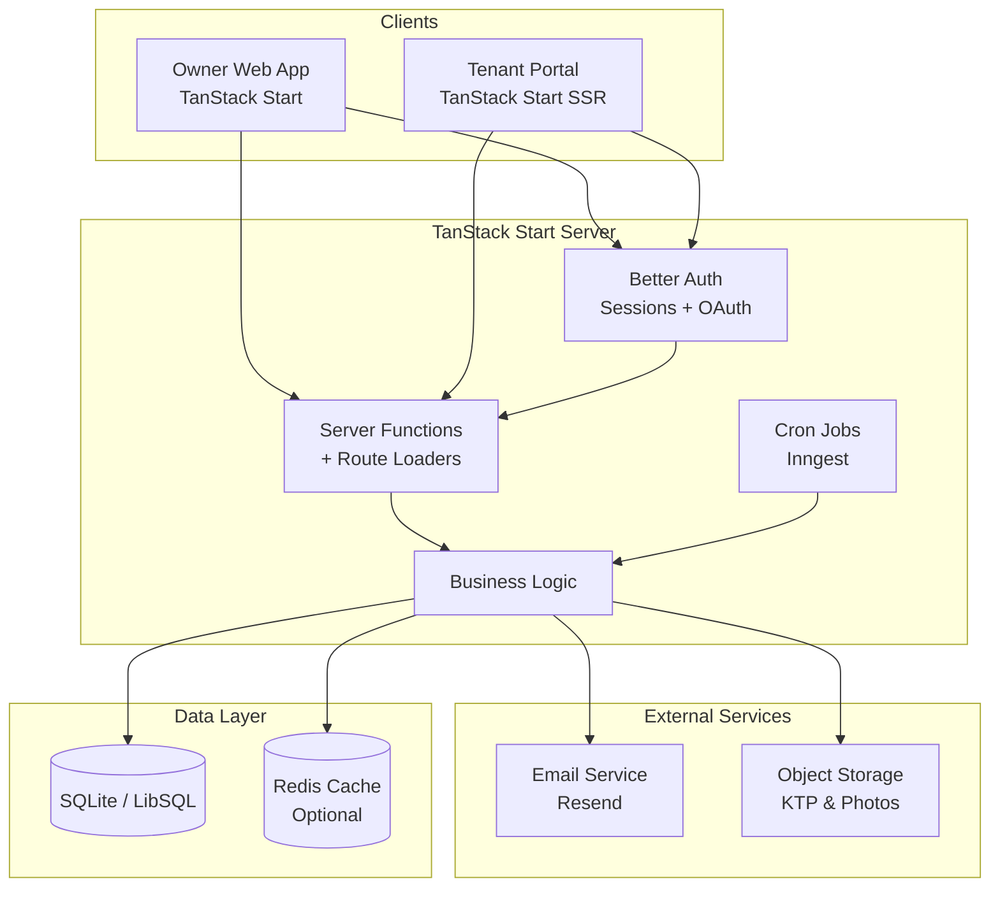
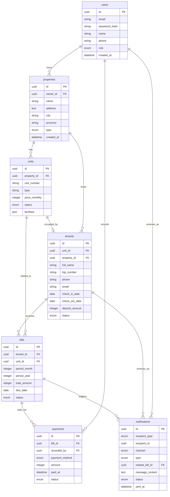

# PRD — Project Requirements Document

## 1. Overview

**Nama Produk:** KostManager (working title)

**Masalah yang Diselesaikan:**
Jutaan pemilik kost dan kontrakan di Indonesia masih mengelola properti secara manual — mencatat penghuni di buku, menagih sewa via chat satu per satu, dan tidak punya visibilitas keuangan yang jelas. Proses ini memakan waktu, rawan kesalahan (lupa tagih, salah hitung), dan sulit di-scale ketika jumlah unit bertambah. Solusi yang ada di pasar (Mamikos, Travelio, dll) lebih fokus ke *marketplace pencarian kost* untuk penyewa, bukan *tools operasional* untuk pemilik.

**Tujuan Utama:**
Membangun aplikasi SaaS yang membantu pemilik kost, pengelola properti, dan agen kontrakan untuk:
- Mengelola data unit & penghuni di satu tempat terpusat
- Mengotomasi pembuatan tagihan bulanan
- Mencatat pembayaran penghuni secara manual (cash/transfer) di satu dashboard
- Memantau performa keuangan & okupansi secara real-time
- Mengirim notifikasi tagihan via email atau notifikasi in-app

Aplikasi akan dipasarkan sebagai produk B2B SaaS di Indonesia dengan model freemium.

---

## 2. Requirements

### Functional Requirements
- Pemilik harus dapat membuat & mengelola banyak properti dengan banyak unit
- Setiap unit dapat memiliki status: tersedia, terisi, atau dalam maintenance
- Data penghuni wajib menyertakan identitas (KTP), kontak, dan periode sewa
- Tagihan dibuat otomatis setiap bulan berdasarkan harga sewa + utilitas
- Pemilik dapat mencatat pembayaran manual (cash, transfer bank langsung)
- Penghuni dapat melihat daftar tagihan mereka lewat portal web
- Dashboard harus menampilkan metrik: total pemasukan, tunggakan, occupancy rate
- Laporan keuangan dapat diexport ke PDF dan Excel

### Non-Functional Requirements
- Aplikasi harus responsif (dapat diakses dari HP & desktop)
- Waktu muat halaman < 2 detik
- Mendukung hingga 10.000 properti & 100.000 unit per tenant
- Data sensitif (KTP, kontrak) harus terenkripsi saat diam (at rest) dan saat transit
- Uptime target: 99.5%

### Business Requirements
- MVP siap rilis dalam 2–3 bulan pengembangan
- Mendukung bahasa Indonesia sebagai bahasa utama
- Menggunakan mata uang Rupiah (IDR) di seluruh aplikasi
- Mematuhi regulasi PSE (Penyelenggara Sistem Elektronik) Kominfo
- Siap untuk sertifikasi PDP (Perlindungan Data Pribadi) di fase selanjutnya

---

## 3. Core Features

### MVP (Fase 1 — Rilis Awal)
- **Manajemen Properti & Unit** — CRUD properti, tipe kamar, harga, fasilitas, status ketersediaan
- **Database Penghuni** — Simpan data KTP, kontak, pekerjaan, foto, periode kontrak
- **Tagihan Otomatis** — Generate tagihan bulanan (sewa + listrik + air + wifi + kebersihan) dengan jadwal cron
- **Catat Pembayaran Manual** — Pemilik/pengelola input pembayaran cash atau transfer langsung dari penghuni
- **Notifikasi In-App & Email** — Reminder tagihan ke penghuni, konfirmasi pembayaran, pengumuman
- **Dashboard Pemilik** — Ringkasan pemasukan, tunggakan, okupansi, grafik bulanan
- **Portal Penghuni** — Halaman publik/terlogin untuk penghuni melihat tagihan mereka
- **Laporan Export** — PDF & Excel untuk tagihan dan laporan keuangan

### Phase 2 (Post-Launch)
- **Pembayaran Digital** — Integrasi payment gateway (Xendit/Midtrans) untuk QRIS, VA, e-wallet
- **Notifikasi WhatsApp** — Reminder tagihan via WhatsApp Business API
- **Kontrak Digital** — Generate & tanda tangan elektronik surat perjanjian sewa
- **Deposit Management** — Tracking uang jaminan & potongan saat check-out
- **Maintenance Request** — Penghuni lapor kerusakan dengan foto dan tracking status
- **Check-in/Check-out Checklist** — Inventaris kamar & pencatatan meteran
- **Multi-Property Dashboard** — Dashboard terpusat untuk beberapa lokasi

### Phase 3 (Premium)
- **AI Pricing Recommendation** — Saran harga sewa berdasarkan market sekitar
- **KTP OCR Verification** — Scan e-KTP otomatis untuk validasi penghuni
- **Smart Lock Integration** — Kunci pintar yang expire otomatis saat kontrak habis
- **Tenant Mobile App** — Aplikasi terpisah untuk penghuni
- **Integrasi Akuntansi** — Sync ke Jurnal.id, BukuKas, atau Mekari

---

## 4. User Flow

### Flow 1: Onboarding Pemilik Kost (Pertama Kali)
1. Daftar akun dengan email/Google
2. Verifikasi email & lengkapi profil (nama, no HP, nama bisnis)
3. Onboarding wizard: tambah properti pertama (nama, alamat, jumlah kamar)
4. Tambah unit-unit (nomor kamar, tipe, harga sewa)
5. Dashboard siap digunakan

### Flow 2: Menambahkan Penghuni Baru
1. Pilih unit kosong dari daftar properti
2. Klik "Tambah Penghuni" → isi data KTP, kontak, pekerjaan
3. Upload foto KTP
4. Tentukan tanggal masuk, durasi kontrak, deposit
5. Kirim link portal penghuni via email
6. Status unit berubah jadi "Terisi"

### Flow 3: Siklus Tagihan Bulanan (Manual Payment)
1. Cron job berjalan H-5 jatuh tempo → generate tagihan semua unit aktif
2. Notifikasi tagihan terkirim ke penghuni via email + in-app
3. Penghuni login ke portal → melihat daftar tagihan
4. Penghuni bayar ke pemilik via cash/transfer langsung di luar aplikasi
5. Pemilik catat pembayaran di dashboard (pilih metode: cash/transfer, input nominal & tanggal)
6. Status tagihan otomatis berubah jadi "Lunas"
7. Notifikasi "Pembayaran Tercatat" dikirim ke penghuni
8. Dashboard pemilik update pemasukan real-time

### Flow 4: Laporan Bulanan
1. Pemilik pilih periode (bulan/tahun) di menu Laporan
2. Sistem kompilasi data: pendapatan, tunggakan, okupansi, utilitas
3. Preview laporan di layar
4. Export PDF untuk arsip atau dibagi ke partner bisnis
5. Export Excel untuk analisis lanjutan

---

## 5. Architecture

Aplikasi dibangun dengan arsitektur **monolithic full-stack** menggunakan **TanStack Start** — full-stack React framework yang didukung oleh TanStack Router, dengan fitur SSR, streaming, server functions, dan bundling via Vite [1]. Pendekatan ini dipilih karena:
- Tim awal kecil (1–3 developer), monolith lebih cepat dikembangkan
- Type-safe routing bawaan TanStack Router mengurangi bug routing
- Server functions memudahkan eksekusi kode server-side tanpa setup API manual
- Didukung Vite sehingga build cepat dan mudah di-deploy ke berbagai hosting [1]
- Bisa di-scale vertikal dulu sebelum perlu microservices

**Penjelasan Layer:**
- **Client Layer**: Owner Web App (dashboard utama) dan Tenant Portal (halaman ringan untuk lihat tagihan) — keduanya dirender dengan TanStack Start
- **Auth Layer**: Better Auth menangani login, session, OAuth (Google), dan role-based access (owner, manager, tenant)
- **Server Layer**: Server functions + route loaders dari TanStack Start menangani semua operasi CRUD & business logic, tanpa perlu REST API terpisah
- **Cron Jobs**: Trigger pembuatan tagihan bulanan, reminder H-5, dan cleanup data — dijalankan via Inngest atau cron sederhana
- **External Services**: Email (Resend) untuk notifikasi dan storage (R2/S3) untuk file KTP/foto
- **Data Layer**: SQLite (LibSQL/Turso di production) untuk database utama, Redis opsional untuk cache

---

## 6. Database Schema

7 tabel utama yang diperlukan untuk MVP:

### users
Data pemilik/pengelola aplikasi.
- `id` (UUID, PK) — identifier unik
- `email` (string, unique) — email login
- `password_hash` (string, nullable) — hash password (nullable jika pakai OAuth)
- `name` (string) — nama lengkap
- `phone` (string, nullable) — nomor HP
- `role` (enum: owner, manager) — role dalam organisasi
- `created_at` (datetime) — waktu registrasi

### properties
Data properti (kost/kontrakan).
- `id` (UUID, PK) — identifier unik
- `owner_id` (UUID, FK → users) — pemilik properti
- `name` (string) — nama properti (contoh: "Kost Melati")
- `address` (text) — alamat lengkap
- `city` (string) — kota
- `province` (string) — provinsi
- `type` (enum: kost, kontrakan, apartemen) — tipe properti
- `created_at` (datetime) — waktu dibuat

### units
Kamar atau unit individual dalam properti.
- `id` (UUID, PK) — identifier unik
- `property_id` (UUID, FK → properties) — properti induk
- `unit_number` (string) — nomor/nama kamar
- `type` (string) — tipe unit (AC/Non-AC, single/double)
- `price_monthly` (integer) — harga sewa per bulan dalam Rupiah
- `status` (enum: available, occupied, maintenance) — status unit
- `facilities` (json) — daftar fasilitas

### tenants
Data penghuni/penyewa.
- `id` (UUID, PK) — identifier unik
- `unit_id` (UUID, FK → units) — unit yang dihuni
- `property_id` (UUID, FK → properties) — properti (untuk query cepat)
- `full_name` (string) — nama lengkap
- `ktp_number` (string) — nomor KTP
- `ktp_photo_url` (string, nullable) — URL foto KTP di storage
- `phone` (string) — nomor HP
- `email` (string) — email (untuk notifikasi)
- `occupation` (string, nullable) — pekerjaan
- `check_in_date` (date) — tanggal masuk
- `check_out_date` (date, nullable) — tanggal keluar
- `deposit_amount` (integer) — uang deposit
- `status` (enum: active, inactive, blacklisted) — status penghuni

### bills
Tagihan bulanan yang di-generate otomatis.
- `id` (UUID, PK) — identifier unik
- `tenant_id` (UUID, FK → tenants) — penghuni yang ditagih
- `unit_id` (UUID, FK → units) — unit terkait
- `period_month` (integer) — bulan tagihan (1–12)
- `period_year` (integer) — tahun tagihan
- `rent_amount` (integer) — biaya sewa
- `electricity_amount` (integer) — biaya listrik
- `water_amount` (integer) — biaya air
- `wifi_amount` (integer) — biaya wifi
- `other_amount` (integer) — biaya lain-lain
- `total_amount` (integer) — total tagihan
- `due_date` (date) — tanggal jatuh tempo
- `status` (enum: pending, paid, overdue, partial) — status pembayaran
- `created_at` (datetime) — waktu tagihan dibuat

### payments
Setiap transaksi pembayaran yang dicatat manual oleh pemilik.
- `id` (UUID, PK) — identifier unik
- `bill_id` (UUID, FK → bills) — tagihan yang dibayar
- `recorded_by` (UUID, FK → users) — pemilik/pengelola yang mencatat
- `payment_method` (enum: cash, bank_transfer, qris_manual, other) — metode bayar
- `amount` (integer) — jumlah dibayar
- `paid_at` (datetime) — waktu pembayaran aktual
- `notes` (text, nullable) — catatan tambahan
- `status` (enum: recorded, void) — status pencatatan

### notifications
Log notifikasi email & in-app untuk audit.
- `id` (UUID, PK) — identifier unik
- `recipient_type` (enum: tenant, owner) — tipe penerima
- `recipient_id` (UUID) — ID penerima
- `channel` (enum: email, in_app) — kanal pengiriman
- `type` (enum: bill_reminder, payment_confirm, announcement, overdue) — tipe pesan
- `related_bill_id` (UUID, FK → bills, nullable) — tagihan terkait
- `subject` (string, nullable) — subjek (khusus email)
- `message_content` (text) — isi pesan
- `status` (enum: queued, sent, delivered, failed) — status pengiriman
- `sent_at` (datetime) — waktu dikirim

---

## 7. Tech Stack

### Recommended Stack
| Layer | Technology | Alasan |
|---|---|---|
| **Framework** | TanStack Start | Full-stack React framework dengan type-safe routing, SSR, server functions, dibundel oleh Vite [1] |
| **Router** | TanStack Router | Type-safe, search-param validation, loader pattern bawaan |
| **Language** | TypeScript | Type safety untuk bisnis logic yang kompleks |
| **Styling** | Tailwind CSS | Utility-first, cepat develop UI |
| **UI Components** | shadcn/ui (Radix-based) | Komponen React kustomizable, ringan, cocok dengan TanStack Start |
| **ORM** | Drizzle ORM | Type-safe, ringan, native SQLite support, migration-friendly |
| **Database** | SQLite (dev) → LibSQL/Turso (prod) | Dev lokal murah, prod scalable & cloud-ready |
| **Authentication** | Better Auth | Lightweight, support OAuth + magic link + sessions |
| **Hosting** | Nitro-compatible (Vercel / Railway / Cloudflare) | TanStack Start di-bundle via Nitro, deploy fleksibel [1] |
| **Email** | Resend | Developer-friendly, deliverability bagus, template React Email |
| **File Storage** | Cloudflare R2 atau AWS S3 | Murah, S3-compatible |
| **Cron Jobs** | Inngest atau node-cron | Reliable, easy to debug, type-safe |

### Mengapa Stack Ini?
- **TanStack Start + Drizzle + SQLite**: Kombinasi modern full-stack tanpa boilerplate API server terpisah, dengan type-safe routing bawaan [1]
- **LibSQL (Turso)** di production: SQLite-compatible tapi bisa di-scale, support replication, branchable untuk testing
- **Better Auth**: Lebih ringan dari NextAuth untuk use case sederhana, built-in UI components
- **Resend + React Email**: Template email bisa di-author dalam React — konsisten dengan stack frontend
- **Inngest**: Cron jobs yang type-safe dengan retry & observability built-in

### Upgrade Path (saat scale)
- Tambah **integrasi payment gateway** (Xendit/Midtrans) di Phase 2
- Tambah **WhatsApp Business API** (Fonnte/WA Cloud API) di Phase 2
- Migrasi dari SQLite ke **PostgreSQL** jika perlu fitur advanced (full-text search, GIS)
- Tambah **Redis** untuk cache dashboard & session saat traffic tinggi
- Tambah **BullMQ / Inngest queues** untuk job berat (bulk email, laporan besar)

---

## Langkah Selanjutnya

1. Validasi ide dengan 5–10 calon pemilik kost (user interview)
2. Buat desain wireframe di Figma (dashboard & tenant portal)
3. Setup repository & infrastruktur dasar (TanStack Start + Drizzle + Better Auth)
4. Kembangkan MVP Phase 1 dalam 8–10 minggu
5. Launch beta tertutup dengan 10–20 pengguna awal
6. Iterasi berdasarkan feedback → tambahkan Payment Gateway & WA di Phase 2

Citation:
[1] TanStack Start documentation — full-stack React framework powered by TanStack Router with SSR, server functions, streaming, bundling via Vite.
